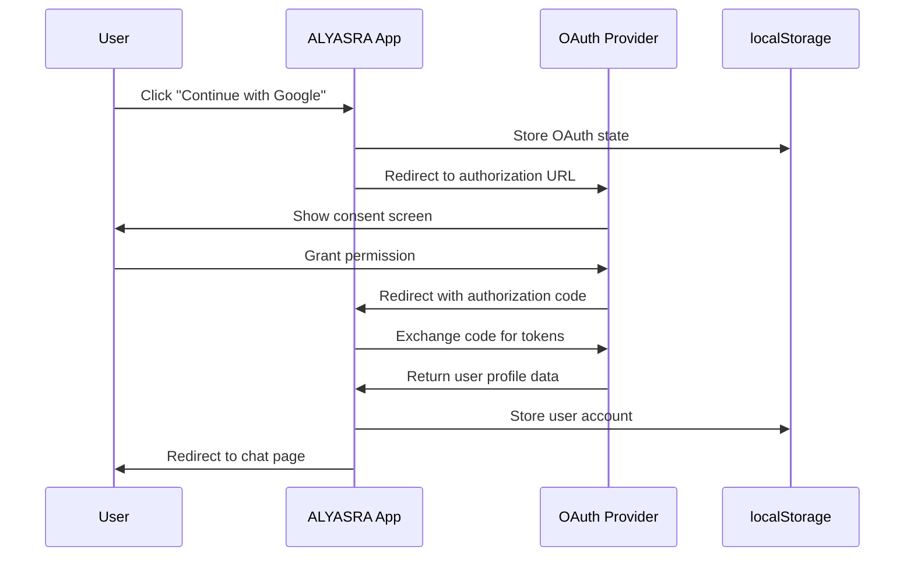

# ALYASRA Project - Source Code Explanation

## 📁 Project Structure Overview

### Core Application Files

#### `src/App.tsx`
- **Purpose**: Main application component that sets up routing
- **Contains**: React Router configuration, main app layout, route definitions
- **Key Features**: Navigation between login, signup, and chat pages

#### `src/main.tsx`
- **Purpose**: Application entry point
- **Contains**: React app initialization, context providers setup
- **Functionality**: Renders the root App component with necessary providers

#### `src/index.css`
- **Purpose**: Global styling and design system definitions
- **Contains**: 
  - Tailwind CSS imports
  - CSS custom properties (color tokens, gradients, shadows)
  - Design system variables for consistent theming
  - Dark/light mode color definitions
- **Key Variables**:
  - `--primary`: Main brand color (blue theme)
  - `--gradient-primary`: Primary gradient for buttons/backgrounds
  - `--gradient-blue`: Background gradient for pages
  - `--shadow-elegant`: Consistent box shadow styling

#### `tailwind.config.ts`
- **Purpose**: Tailwind CSS configuration
- **Contains**: 
  - Color system mapping to CSS variables
  - Custom gradient definitions
  - Animation configurations
  - Responsive breakpoints
- **Features**: HSL color system integration, semantic design tokens

---

### 🔐 Authentication System

#### `src/pages/Login.tsx`
- **Purpose**: User login page with traditional email/password and OAuth options
- **Contains**:
  - Email/password form validation
  - Integration with OAuthLogin component
  - User account management via localStorage
  - Responsive design with gradient background
- **Functionality**:
  - Creates new users or logs in existing ones
  - Stores user data in localStorage under 'alyasra_accounts'
  - Redirects to chat page after successful login

#### `src/pages/Signup.tsx`
- **Purpose**: User registration page
- **Contains**: New user account creation form
- **Features**: Validates user input, creates account in localStorage

#### `src/components/OAuthLogin.tsx` ⭐ **MAIN OAUTH COMPONENT**
- **Purpose**: Handles social media authentication (Google, Microsoft, Outlook, Yahoo, Hotmail)
- **Architecture**:
  - **Primary Providers**: Google and Microsoft (always visible)
  - **Secondary Panel**: Outlook, Yahoo, Hotmail (shows after clicking Microsoft)
  - **OAuth Flow**: Authorization code flow with CSRF protection
- **Key Functions**:
  - `buildAuthUrl()`: Constructs OAuth provider URLs with proper parameters
  - `handleOAuthLogin()`: Initiates OAuth flow, stores state in localStorage
  - `handleOAuthCallback()`: Processes return from OAuth provider
  - `mockTokenExchange()`: Simulates token exchange (replace with real backend calls)
- **Security Features**:
  - State parameter validation for CSRF protection
  - Secure redirect URI handling
  - Timestamp validation

#### `src/contexts/UserContext.tsx`
- **Purpose**: Global user state management
- **Contains**: User authentication state, login/logout functions
- **Features**: React Context for user data across components

---

### 🎨 UI Components (`src/components/ui/`)

These are pre-built Shadcn/UI components providing consistent design:

#### Core Input Components
- `button.tsx`: Styled button variants (primary, secondary, outline, ghost)
- `input.tsx`: Form input fields with consistent styling
- `label.tsx`: Form labels with proper accessibility
- `textarea.tsx`: Multi-line text input

#### Layout Components
- `card.tsx`: Container component for content sections
- `separator.tsx`: Visual dividers between content
- `dialog.tsx`: Modal dialogs and overlays
- `sheet.tsx`: Slide-out panels

#### Data Display
- `avatar.tsx`: User profile pictures
- `badge.tsx`: Status indicators and tags
- `table.tsx`: Data tables with sorting/filtering
- `chart.tsx`: Data visualization components

#### Navigation
- `breadcrumb.tsx`: Navigation breadcrumbs
- `navigation-menu.tsx`: Top-level navigation
- `sidebar.tsx`: Collapsible side navigation

#### Form Components
- `form.tsx`: Form validation and error handling
- `checkbox.tsx`, `radio-group.tsx`: Selection inputs
- `select.tsx`: Dropdown selections
- `slider.tsx`: Range inputs

#### Feedback Components
- `toast.tsx`: Notification messages
- `alert.tsx`: Important messages
- `progress.tsx`: Loading indicators
- `skeleton.tsx`: Loading placeholders

---

### 🗂️ Other Components

#### `src/components/ChatHeader.tsx`
- **Purpose**: Header for chat interface
- **Contains**: User info, navigation controls

#### `src/components/ChatInput.tsx`
- **Purpose**: Message input area in chat
- **Features**: Text input, send button, formatting options

#### `src/components/ChatMessage.tsx`
- **Purpose**: Individual chat message display
- **Features**: Message styling, timestamp, user identification

#### `src/components/ChatSidebar.tsx`
- **Purpose**: Chat navigation sidebar
- **Contains**: Chat history, user management

#### `src/components/ShareDialog.tsx`
- **Purpose**: Social sharing functionality
- **Features**: Share links, social media integration

#### `src/components/CollaborationDialog.tsx`
- **Purpose**: Team collaboration features
- **Features**: Invite users, manage permissions

---

### 📄 Page Components (`src/pages/`)

#### `src/pages/Index.tsx`
- **Purpose**: Homepage/landing page
- **Contains**: Welcome content, navigation to login/signup

#### `src/pages/NotFound.tsx`
- **Purpose**: 404 error page
- **Features**: Error message, navigation back to main app

---

### 🔧 Utility Files

#### `src/lib/utils.ts`
- **Purpose**: Utility functions
- **Contains**: `cn()` function for className merging using clsx and tailwind-merge

#### `src/hooks/use-mobile.tsx`
- **Purpose**: Responsive design hook
- **Features**: Detects mobile screen sizes

#### `src/hooks/use-toast.ts`
- **Purpose**: Toast notification management
- **Features**: Show/hide toast messages

---

## 🔐 OAuth Setup and Registration

### Why Manual App Registration is Required

**OAuth apps must be manually registered** because:

1. **Security Requirements**: OAuth providers need to verify your application identity
2. **Redirect URI Validation**: Providers must whitelist your domain for security
3. **Rate Limiting**: Each app gets specific quotas and limits
4. **Branding**: You can customize the OAuth consent screen
5. **Client ID/Secret**: Unique credentials are generated for your specific app

### OAuth Flow Explanation



### Current Implementation Features

✅ **Implemented**:
- Authorization code flow with PKCE
- State parameter CSRF protection
- Multiple provider support
- User data extraction and storage
- Responsive UI with collapsible provider panels

⚠️ **Mock Implementation**:
- Token exchange (needs real backend)
- User profile fetching (currently simulated)

🔮 **Future Enhancements**:
- Real backend integration
- Token refresh handling
- Advanced user profile management
- Social media posting capabilities

---

## 🚀 Getting Started

### 1. Register OAuth Applications
Follow the `OAUTH_SETUP_GUIDE.md` to register your app with:
- Google (Google Cloud Console)
- Microsoft (Azure Portal)
- Yahoo (Yahoo Developer Network)
- Outlook/Hotmail (Microsoft Live)

### 2. Update Configuration
Replace placeholder client IDs in `src/components/OAuthLogin.tsx`:
```javascript
const oauthConfigs = {
  google: {
    clientId: 'YOUR_ACTUAL_GOOGLE_CLIENT_ID', // Replace this
    // ... rest of config
  }
  // ... other providers
};
```

### 3. Test Locally
```bash
npm run dev
# Visit http://localhost:5173
# Try OAuth login buttons
```

### 4. Deploy to Production
- Update all OAuth apps with production domain
- Update redirect URIs to match your live site
- Test all providers in production environment

---

## 📋 File Dependencies

```
src/pages/Login.tsx
├── src/components/OAuthLogin.tsx (OAuth buttons)
├── src/contexts/UserContext.tsx (User state)
├── src/components/ui/* (UI components)
└── src/lib/utils.ts (Utilities)

src/components/OAuthLogin.tsx
├── localStorage (User data storage)
├── window.location (OAuth redirects)
└── React hooks (State management)
```

---

This architecture provides a solid foundation for OAuth authentication while maintaining security best practices and a clean, maintainable codebase.
